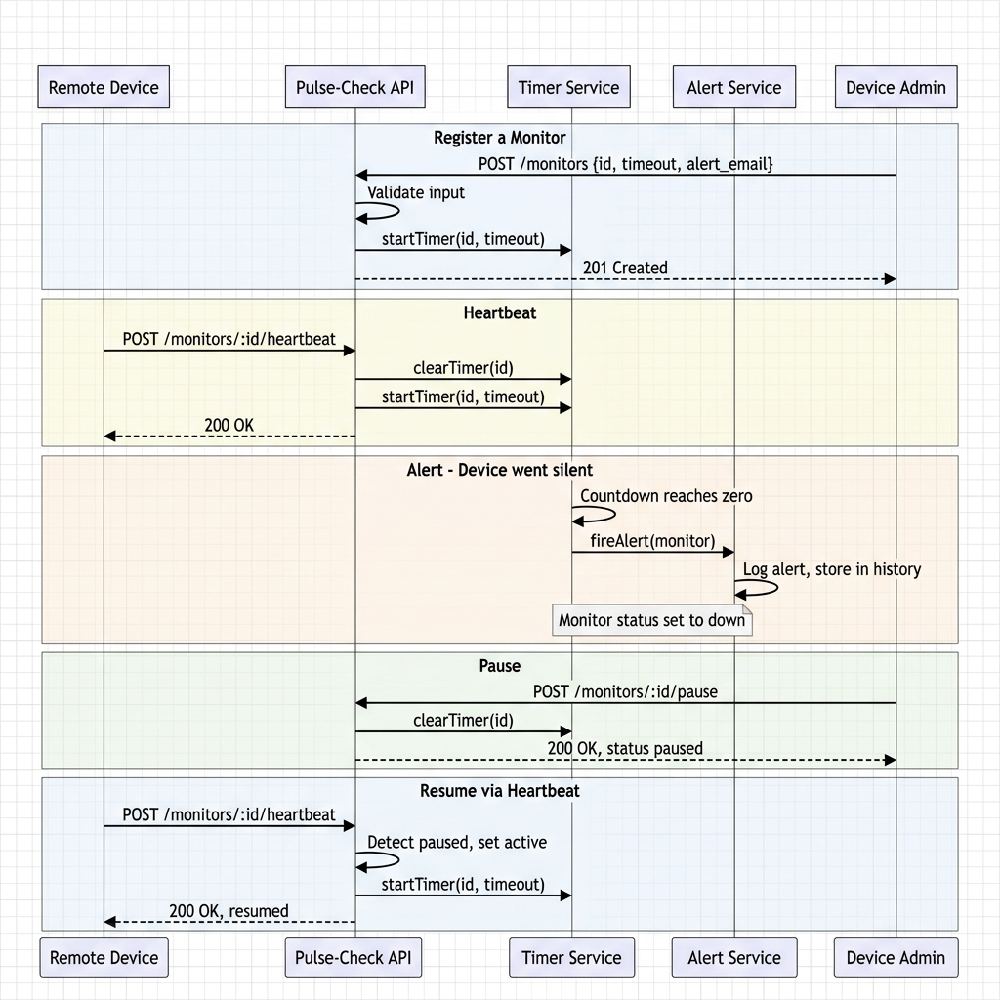
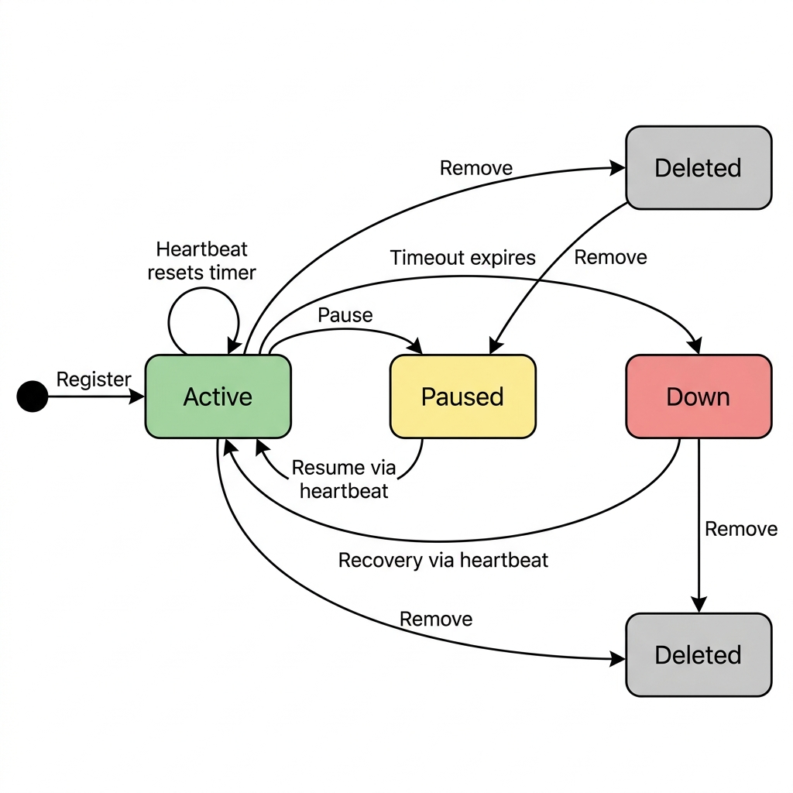

# Pulse-Check-API ("Watchdog" Sentinel)

A Dead Man's Switch API backend service. Devices register a monitor with a countdown timer. If the device fails to send a heartbeat ping before the timer runs out, the system automatically triggers an alert.

## 1. Architecture Diagrams

### Sequence Diagram
Shows the interaction flow for all API operations.



### State Flowchart
Shows the lifecycle states of a monitor.



## 2. Setup Instructions

### Prerequisites
- Node.js (v24+)
- pnpm (v10+)

### Installation
1. Clone the repository:
   ```bash
   git clone <your-repo-url>
   cd Pulse-Check-API
   ```
2. Install dependencies:
   ```bash
   pnpm install
   ```
3. Set up environment variables:
   ```bash
   cp .env.example .env
   ```

### Running the Application
- **Development Mode** (auto-reloads on changes):
  ```bash
  pnpm dev
  ```
- **Production Build**:
  ```bash
  pnpm build
  pnpm start
  ```
- **Run Tests**:
  ```bash
  pnpm test
  ```

## 3. API Documentation

For the full interactive API documentation, run the server and navigate to `http://localhost:3000/api-docs` (Swagger UI).

### Register a Monitor
`POST /monitors`
Registers a new device monitor and starts its countdown timer.
- **Request Body** (`application/json`):
  ```json
  {
    "id": "device-123",
    "timeout": 60,
    "alert_email": "admin@critmon.com"
  }
  ```
- **Success Response** (`201 Created`):
  ```json
  {
    "success": true,
    "message": "Monitor 'device-123' created. Timer set for 60s.",
    "data": {
      "id": "device-123",
      "timeout": 60,
      "alertEmail": "admin@critmon.com",
      "status": "active",
      "createdAt": "2026-06-16T12:00:00.000Z",
      "lastHeartbeat": null,
      "updatedAt": "2026-06-16T12:00:00.000Z"
    }
  }
  ```

### Send a Heartbeat
`POST /monitors/:id/heartbeat`
Pings the server to indicate the device is alive. Resets the timer. If paused or down, it becomes active.
- **Success Response** (`200 OK`):
  ```json
  {
    "success": true,
    "message": "Heartbeat received. Timer reset to 60s.",
    "data": { ...monitor details... }
  }
  ```

### Pause a Monitor (Snooze)
`POST /monitors/:id/pause`
Pauses the countdown timer (e.g., for maintenance). No alerts will fire. Sending a heartbeat resumes it.
- **Success Response** (`200 OK`):
  ```json
  {
    "success": true,
    "message": "Monitor 'device-123' paused. No alerts will fire.",
    "data": { ...monitor details... }
  }
  ```

### Get All Monitors
`GET /monitors`
- **Success Response** (`200 OK`):
  ```json
  {
    "success": true,
    "count": 1,
    "data": [ { ...monitor details... } ]
  }
  ```

### Get a Specific Monitor
`GET /monitors/:id`
- **Success Response** (`200 OK`):
  ```json
  {
    "success": true,
    "data": { ...monitor details... }
  }
  ```

### Delete a Monitor
`DELETE /monitors/:id`
Removes the monitor and clears its timer.
- **Success Response** (`200 OK`):
  ```json
  {
    "success": true,
    "message": "Monitor 'device-123' deleted."
  }
  ```

### Alert Trigger (Internal)
When a timer expires (reaches 0), the system logs a JSON alert to the console and changes the monitor's status to `down`.
```json
{"ALERT":"Device device-123 is down!","time":"2026-06-16T12:01:00.000Z"}
```

## 4. The Developer's Choice

**Feature:** Alert History and System Health Dashboard API

**Why I added it:**
CritMon doesn't just need real-time alerts; they need to investigate incidents after the fact. A device might go down and recover multiple times in a day. 
I added:
1. `GET /monitors/:id/alerts` - Returns a history of all alert events for a specific device.
  ```json
  {
    "success": true,
    "count": 1,
    "data": [
      {
        "monitorId": "device-123",
        "alertedAt": "2026-06-16T12:01:00.000Z",
        "message": "Device device-123 is down!"
      }
    ]
  }
  ```
2. `GET /stats` - Returns a high-level system summary.
  ```json
  {
    "success": true,
    "data": {
      "monitors": { "total": 5, "active": 4, "down": 0, "paused": 1 },
      "alerts": { "total": 12 }
    }
  }
  ```

This makes the system much more robust for operations and support engineers to review past behavior, not just current state.

**Design Decisions:**
- Kept things simple and readable, using in-memory stores (Maps/Arrays) to avoid over-engineering with a database, as appropriate for the scope of this challenge.
- Used a clean, layered architecture (Routes -> Controllers -> Services -> Store) to enforce separation of concerns and maintainability.
